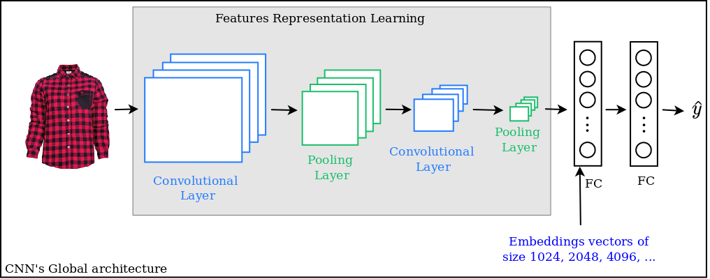

## Requirements

1. ```tensorflow==2.0.1```
2. ```numpy==1.18.1```
3. ```nmslib==2.0.6```

Further requirements are described in file ```requirements.txt```.

## Idea behind IBRS

A user who clicks on a product is usually interested in products with a similar styles. It will then be useful to recommend to that user product with similar styles.

<center>  </center>
<center> <b> Figure 1 </b>: A user browsing a tiled shirt </center>

The entire implementation process is described in the ```Image-based Recommender System.ipynb``` notebook.

## Problem

1. How to compare two images and measure their similarity ? 
2. On which criterion can we attest that two products have similar styles ?

By using <b>image understanding models</b>, we will be able to capture styles of products and compare them in order to recommend most similar products.

## Image understanding

Thanks to the advance of Deep Learning models, algorithms are able to understand images by learning their features representation (or embeddings). The most suitable Deep Learning model used for image features representation are <b> Convolutional Neural Networks </b> (CNNs). As depicted in the Figure 2, a CNN learns how to represent features of an input image by passing it through convolutional layers stacked on top of each other. The most appropriate layer for extracting features from the image is therefore the fully connected layer next to the last convolutional layer.

<center></center>
<center> <b> Figure 2 </b>: Image understanding with Convolutional Neural Networks</center>

The dimension of extracted features is determined by the dimension the fully connected layer from which these features were extracted. It varies a lot (1024, 2048, ...) depending on the CNN model used. The image features are therefore vectors of real values of the size as described previously. In this repository, we use the <a href="https://research.google.com/pubs/archive/43022.pdf">Inception (GoogLeNet)</a> CNN model, from which the dimension of extracted features is (2048,1)

## Similarity between two images

Since image features are vectors, we can compute similarities between them using standard similarity metrics such as <a href="https://en.wikipedia.org/wiki/Cosine_similarity">cosine similarity</a>. With the cosine similarity, we can measure the distance between each image and the others to know which of them of most similar. This algorithm is also known as <i>k-Nearest Neighbors</i> (k-NN) algorithm. Several k-NN algorithms may be useful. This repository uses <a href="https://github.com/nmslib/nmslib">nmslib (Non-Metric Space Library)</a> to measure similarities between images and compute their k most similar images.

## Top-k recommendation

By ordering similarities between one image and all the others, we can therefore pick the top-k most similar items an recommend it to the user.

Here are some examples of top-10 recommendations, computed over 1655 items. 
<center>
<p></p>
<p></p>
<p></p>
<p></p>
</center>

This recommendation process actually work on <a href="https://shoppinglist.cm/fr/">ShoppingList</a> (an e-commerce plateform in Cameroon) for fashion products.

## Struture of the repository

1. ```dataset.zip```: zipped file containing our items data
2. ```Image-based Recommender System.ipynb``` : Jupyter notebook, illustrating in details how to implement an image-based recommender system. The process is fully described with code. By running this notebook, the following files will be generated :

   - ```dataset``` : folder, obtained by unzipping file ```dataset.zip```
   - ```items metadata```: folder, containing metadata for each items of our database. These metadata are information about items such as ```ID```, ```title```, ```categories```, ```imPath``` (path to the image assiociated to the item). They are displayed in dictionaries as follow:
```
{
    'ID': 2073, 
    'title': 'Sacs à main dame Fiorelli en cuir synthétique ', 
    'slug': 'sac-a-main-dame-fiorelli-en-cuir-synthetique', 
    'category': ['Fashion Women', 'Women Hand Bag'], 
    'imPath': 'images/Fashion Women/Women Hand Bag/DSC_0022_m9aphKf.jpg'
}
```
   - ```googlenet```: folder containing the downloaded googlenet model used for image features extraction.
   - ```image_features``` : folder containing extracted features for all images of our database.
   - ```nmslib index```: nmslib index (space of all image features) used to compute similarities between images.

At the end of the computation process, item's metadata will have two more attributes : ```image_features``` (path to image features of the item) and ```IBSP``` (Image-Based Similar Products) which is the list of ID of the top-10 similar product.

```
{
    'ID': 2073, 
    'title': 'Sacs à main dame Fiorelli en cuir synthétique ', 
    'slug': 'sac-a-main-dame-fiorelli-en-cuir-synthetique', 
    'category': ['Fashion Women', 'Women Hand Bag'], 
    'imPath': 'images/Fashion Women/Women Hand Bag/DSC_0022_m9aphKf.jpg', 
    'image_features': 'images_features/2073.npz', 
    'IBSP': [{'id': 5539, 'sim': 0.8035}, {'id': 6569, 'sim': 0.8035}, {'id': 534, 'sim': 0.7904}, {'id': 1907, 'sim': 0.7876}, {'id': 526, 'sim': 0.7816}, {'id': 3223, 'sim': 0.7799}, {'id': 320, 'sim': 0.7767}, {'id': 6575, 'sim': 0.774}, {'id': 5555, 'sim': 0.772}, {'id': 742, 'sim': 0.7702}]
}
```
## Authors

<b><i>Carmel WENGA</i></b>, Applied Machine Learning Research Engineer | <a href="https://shoppinglist.cm/">ShoppingList</a>, Nzhinusoft
